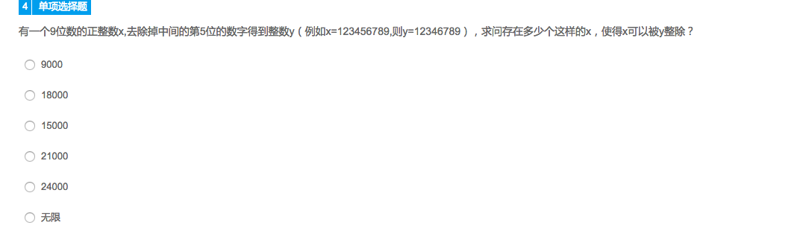
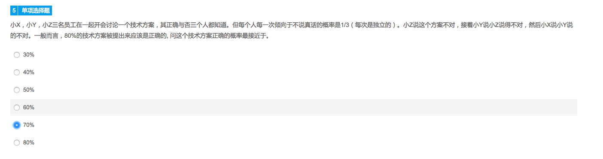
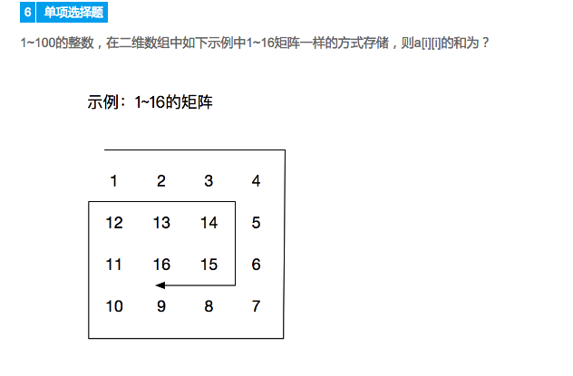

###阿里巴巴2018实习生-研发工程师C/C++考试 模拟 2018.5.7 晚
笔试10分钟3条行为准则3条智力题，附加题是一条编程题，30分钟

思路：  

* 首先不可能是无限，一共才几亿个数
* 较大的数一般有超多因子，要能彻底整除一种可能是x是abcd00000，y是abcd0000，a是首位，9种可能，bcd皆可0~9,9x10x10x10=9000

[程序](./1.cpp)输出结果也是9000，虽然int就够跑，也是O(n)，但9亿次计算还是挺耗时的，智力题应该偏向口算

---

  
贝叶斯

---

  
题意：把1-100按顺时针放入10x10的矩阵，求左上角4x4矩阵元素和  
1+2+3+4+36+37+38+39+35+64+65+66+34+63+84+85=656  
技巧就是跳着算，手快就多写几个，考验手速，以及对求和公式和求项数公式的熟练掌握  

```
1	2	3	4	5	6	7	8	9	10
36	37	38	39	40	41	42	43	44	11
35	64	65	66	67	68	69	70	45	12
34	63	84	85	86	87	88	71	46	13
33	62	83	96	97	98	89	72	47	14
32	61	82	95	100	99	90	73	48	15
31	60	81	94	93	92	91	74	49	16
30	59	80	79	78	77	76	75	50	17
29	58	57	56	55	54	53	52	51	18
28	27	26	25	24	23	22	21	20	19
```
[程序](./3.cpp)写起来才发现还挺玄乎，野震宇同学用的递归，输出了逆时针，我把里面px和py改成输出为顺时针

---

---


本以为就10分钟笔试，潜规则是还有一道附加编程题，限时30分钟

```
有这样一个游戏：主持人拿出事先准备好的 N 个球，每个球上写着一个数字。参赛者每次从其中取出一个球，每个球中都包含一些小礼物。游戏规则规定：不仅球上的数不能是 K 的倍数，而且也不能和某个已取出的球相加得到 K 的倍数。否则，所有的奖励都要被收回。

作为一个参赛者，你希望在不犯规的情况下取出尽可能多的球。已知所有球上的数字，请问最多可以拿到几个球？


已输入字数: 0 / 10000   运行
编译器版本: gcc 4.8.4
请使用标准输入输出(stdin，stdout) ；请把所有程序写在一个文件里，勿使用已禁用图形、文件、网络、系统相关的头文件和操作，如sys/stat.h , unistd.h , curl/curl.h , process.h
时间限制: 2S (C/C++以外的语言为: 4 S)   内存限制: 128M (C/C++以外的语言为: 640 M)

输入:
第 1 行：N K
第 2 行包含 N 个非负整数，表示每个球上的数字
输出:
一个整数，表示最多可以拿到几个球。如果没有任何可行方案，输出0
输入范例:
6 3
1 4 2 5 6 7
输出范例:
3
```

就是遍历所有子集合，可以用一个bool向量来统计